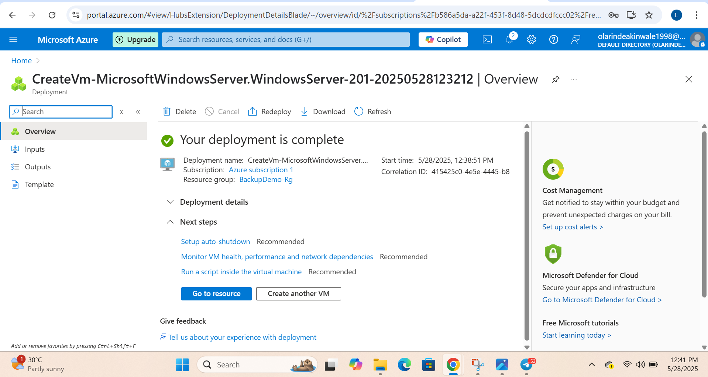
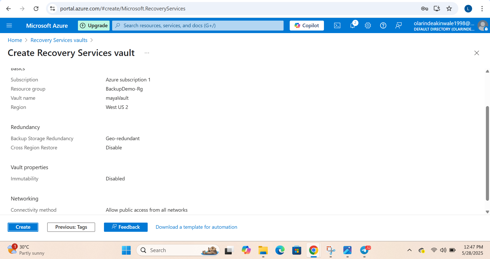
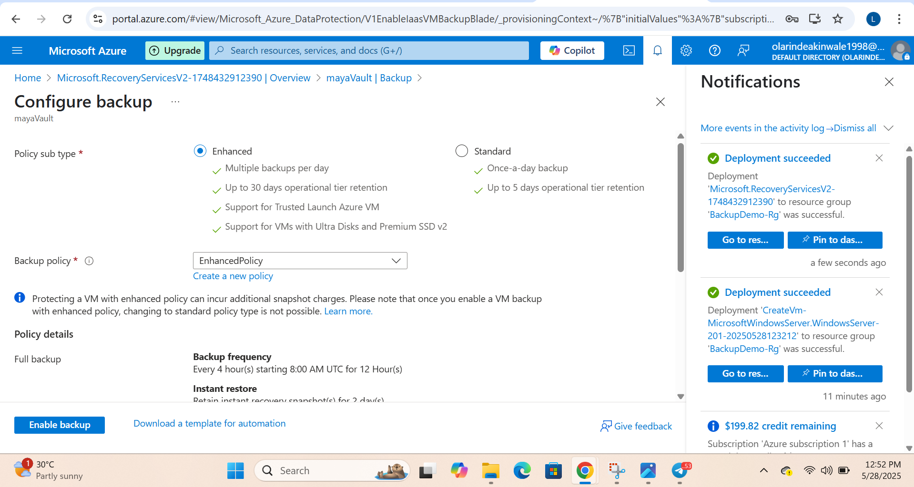
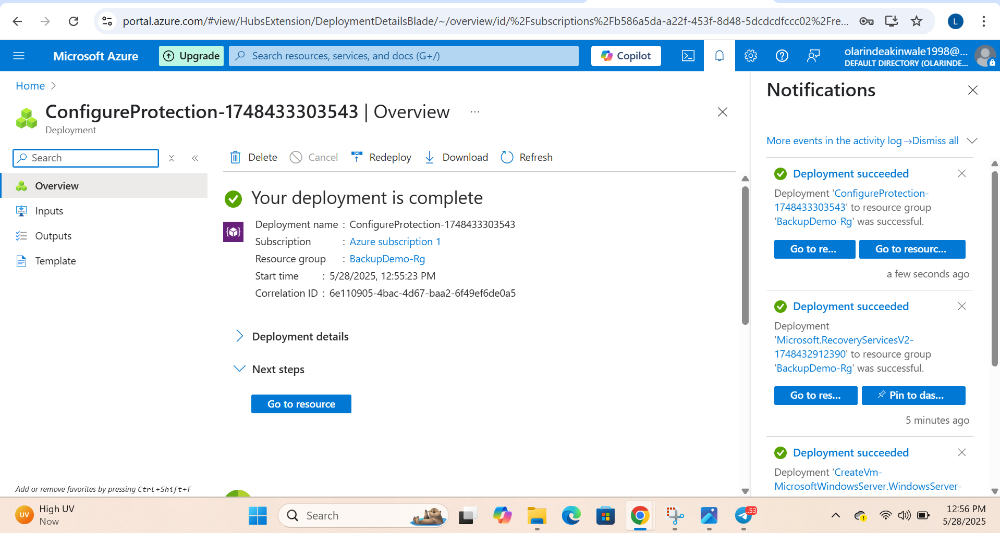
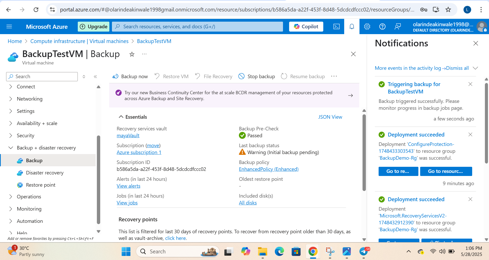
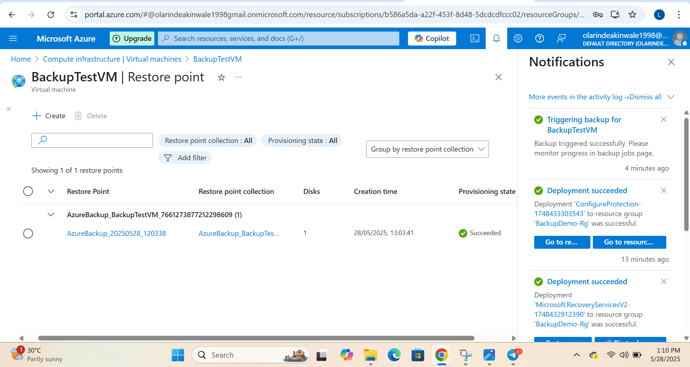
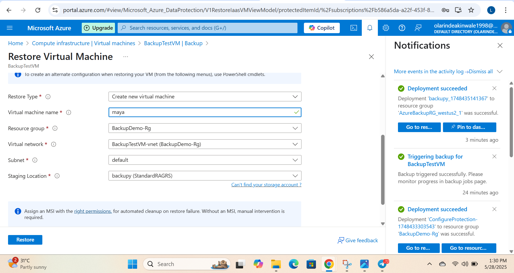
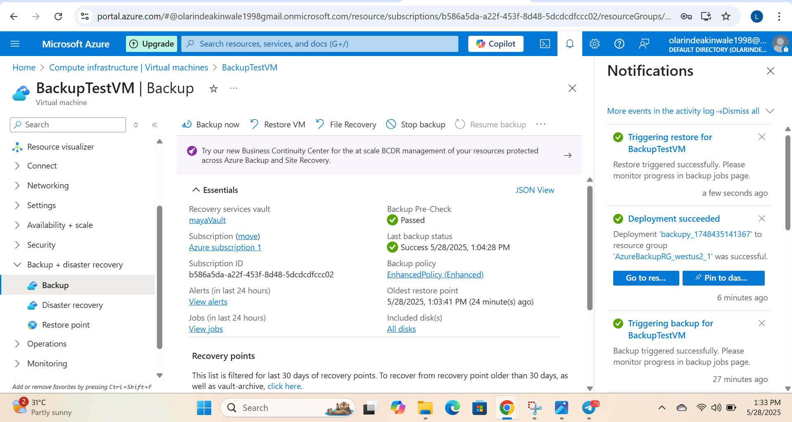

# 🔄 Azure VM Backup and Restore Project

This project demonstrates a full backup and restore cycle for an Azure Virtual Machine using Recovery Services Vault. It reflects real-world disaster recovery practices.

---

## ✅ Scenario

> As a Cloud Security Engineer tasked with safeguarding critical infrastructure. In this scenario, you need to back up a running VM and verify your organization's disaster recovery plan by restoring it from a recovery point.

---

## 🧰 Tools & Resources

- Azure Virtual Machine (Windows Server 2019)
- Recovery Services Vault (mayaVault)
- Azure Backup Policy (Enhanced)
- Azure Storage Account (Staging Location)

---

## 🚀 Steps Performed

### 1. VM Backup Created  
Deployed BackupTestVM and prepared it for backup.  

---

### 2. Recovery Vault Setup  
Created Recovery Services Vault named mayaVault.  

---

### 3. Backup Configuration  
Configured enhanced policy and backup settings for the VM.  

---

### 4. Backup Enabled  
Enabled backup for the VM using the new policy.  

---

### 5. Backup Job Status  
Monitored and confirmed the backup job completed successfully.  

---

### 6. Restore Point Confirmed  
Verified the restore point was successfully generated.  

---

### 7. VM Restore Setup & Review  
Restored the VM using the recovery point, setting new name and resources.  

---

### 8. VM Restore Succeeded  
Restore completed. Verified restored VM is up and healthy.  

---

## ✅ Validation

All steps have been fully tested:
- The restored VM booted up successfully
- Health status is green
- Verified connectivity, OS status, and disk

Everything is running properly and as expected.

---

## 💡 Key Takeaways

- Azure Backup ensures data resiliency and quick disaster recovery
- Recovery Vault + Backup Policy offers automated and scheduled backups
- Testing the restore process is critical for business continuity

---
